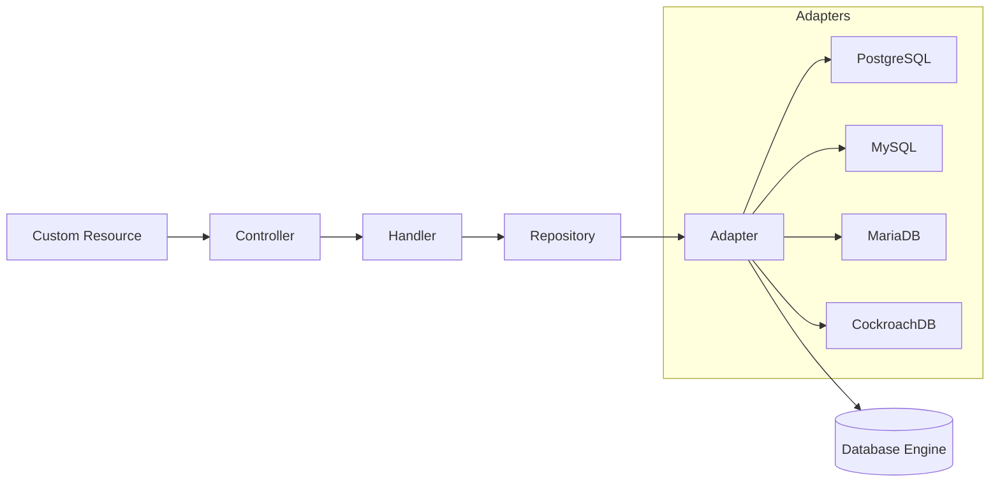

# DB Provision Operator

[](https://github.com/panteparak/db-provision-operator/actions/workflows/ci.yml)
[](https://github.com/panteparak/db-provision-operator/actions/workflows/release.yml)
[](https://goreportcard.com/report/github.com/panteparak/db-provision-operator)
[](http://www.apache.org/licenses/LICENSE-2.0)
[](https://kubernetes.io)

A Kubernetes operator for declarative database lifecycle management across **PostgreSQL**, **MySQL**, **MariaDB**, and **CockroachDB**.

## Overview

Managing database resources (databases, users, roles, grants) manually is error-prone and doesn't fit GitOps workflows. DB Provision Operator solves this by exposing databases as Kubernetes Custom Resources — enabling teams to version-control their entire database topology alongside application manifests.

## Features

- **Multi-engine support** — PostgreSQL, MySQL, MariaDB, CockroachDB
- **Full lifecycle management** — Databases, users, roles, grants via CRDs
- **Automated credential generation** — Secret templates with Go template syntax
- **Password rotation** — Rotate credentials declaratively
- **Backup & restore** — Scheduled backups to S3, GCS, Azure Blob, or PVC with gzip/lz4/zstd compression and AES-256-GCM encryption
- **Drift detection & correction** — Detect and optionally reconcile out-of-band changes
- **Deletion protection** — Dependency-aware deletion prevents accidental data loss
- **Cluster-scoped resources** — Share instances, roles, and grants across namespaces
- **Observability** — 31 Prometheus metrics, 9 Grafana dashboards, OpenTelemetry tracing, structured logging
- **Security** — Non-root containers, seccomp profiles, SQL injection prevention via centralized SQL builder

## Architecture



### Resource Dependency Graph

```
DatabaseInstance / ClusterDatabaseInstance
  ├── Database (via instanceRef / clusterInstanceRef)
  ├── DatabaseUser (via instanceRef / clusterInstanceRef)
  └── DatabaseRole (via instanceRef / clusterInstanceRef)
        └── DatabaseGrant (via userRef / roleRef / databaseRef)
```

### Custom Resource Definitions

| Kind | Short Name | Scope | Description |
|------|-----------|-------|-------------|
| DatabaseInstance | `dbi` | Namespace | Connection to a database server |
| ClusterDatabaseInstance | `cdbi` | Cluster | Cluster-wide database server connection |
| Database | `db` | Namespace | Database within an instance |
| DatabaseUser | `dbu` | Namespace | Database user with credential management |
| DatabaseRole | `dbr` | Namespace | Database role |
| ClusterDatabaseRole | `cdbr` | Cluster | Cluster-wide database role |
| DatabaseGrant | `dbg` | Namespace | Role-to-user grant |
| ClusterDatabaseGrant | `cdbg` | Cluster | Cluster-wide grant |
| DatabaseBackup | `dbbak` | Namespace | One-time database backup |
| DatabaseBackupSchedule | `dbbaksched` | Namespace | Scheduled recurring backups |
| DatabaseRestore | `dbrestore` | Namespace | Restore from a backup |

## Supported Versions

| Component | Version |
|-----------|---------|
| Kubernetes | >= 1.26.0 |
| Go | 1.24+ |

## Installation

### Helm (Recommended)

```bash
helm install db-provision-operator \
  oci://ghcr.io/panteparak/charts/db-provision-operator \
  --namespace db-provision-system \
  --create-namespace
```

### kubectl (Raw Manifests)

```bash
kubectl apply -f https://github.com/panteparak/db-provision-operator/releases/latest/download/install.yaml
```

### GitOps (ArgoCD)

```yaml
apiVersion: argoproj.io/v1alpha1
kind: Application
metadata:
  name: db-provision-operator
  namespace: argocd
spec:
  project: default
  source:
    chart: db-provision-operator
    repoURL: ghcr.io/panteparak/charts
    targetRevision: 0.4.1
    helm:
      values: |
        metrics:
          enabled: true
          serviceMonitor:
            enabled: true
  destination:
    server: https://kubernetes.default.svc
    namespace: db-provision-system
  syncPolicy:
    automated:
      prune: true
      selfHeal: true
    syncOptions:
      - CreateNamespace=true
```

## Quick Start

**1. Create admin credentials**

```yaml
apiVersion: v1
kind: Secret
metadata:
  name: postgres-admin-credentials
type: Opaque
stringData:
  username: postgres
  password: change-me-in-production
```

**2. Register a database instance**

```yaml
apiVersion: dbops.dbprovision.io/v1alpha1
kind: DatabaseInstance
metadata:
  name: postgres-primary
spec:
  engine: postgres
  connection:
    host: postgres.database.svc.cluster.local
    port: 5432
    database: postgres
    sslMode: prefer
    secretRef:
      name: postgres-admin-credentials
  healthCheck:
    enabled: true
    intervalSeconds: 30
    timeoutSeconds: 5
```

**3. Create a database**

```yaml
apiVersion: dbops.dbprovision.io/v1alpha1
kind: Database
metadata:
  name: myapp-database
spec:
  instanceRef:
    name: postgres-primary
  name: myapp
  deletionPolicy: Retain
  postgres:
    encoding: UTF8
    extensions:
      - name: uuid-ossp
        schema: public
      - name: pgcrypto
        schema: public
```

**4. Create a user with auto-generated credentials**

```yaml
apiVersion: dbops.dbprovision.io/v1alpha1
kind: DatabaseUser
metadata:
  name: myapp-user
spec:
  instanceRef:
    name: postgres-primary
  username: myapp_user
  passwordSecret:
    generate: true
    length: 32
    secretName: myapp-user-credentials
    secretTemplate:
      labels:
        app: myapp
      data:
        DATABASE_URL: "postgresql://{{ .Username }}:{{ .Password }}@{{ .Host }}:{{ .Port }}/myapp?sslmode=prefer"
  postgres:
    connectionLimit: 50
```

**5. Grant permissions**

```yaml
apiVersion: dbops.dbprovision.io/v1alpha1
kind: DatabaseGrant
metadata:
  name: myapp-user-grant
spec:
  userRef:
    name: myapp-user
  postgres:
    roles:
      - myapp_readwrite
```

See [`docs/examples/`](docs/examples/) for complete examples across all supported engines.

## Configuration

### Key Helm Values

| Key | Default | Description |
|-----|---------|-------------|
| `replicaCount` | `1` | Number of operator replicas |
| `image.repository` | `ghcr.io/panteparak/db-provision-operator` | Container image |
| `defaultDriftInterval` | `"8h"` | Default drift detection interval |
| `instanceId` | `""` | Operator instance ID (multi-operator) |
| `leaderElect` | `true` | Enable leader election |
| `metrics.enabled` | `false` | Enable metrics endpoint |
| `metrics.serviceMonitor.enabled` | `false` | Create ServiceMonitor CR |
| `grafanaDashboards.enabled` | `false` | Deploy Grafana dashboard ConfigMaps |
| `crds.install` | `true` | Install CRDs with Helm |
| `crds.keep` | `true` | Retain CRDs on uninstall |
| `resources.limits.memory` | `128Mi` | Memory limit |
| `resources.requests.cpu` | `10m` | CPU request |

### Annotations

| Annotation | Value | Effect |
|------------|-------|--------|
| `dbops.dbprovision.io/force-delete` | `"true"` | Bypass deletion protection and dependency checks |
| `dbops.dbprovision.io/skip-reconcile` | `"true"` | Skip reconciliation entirely |
| `dbops.dbprovision.io/deletion-policy` | `"Delete"` / `"Retain"` | Control external resource cleanup on CR deletion |
| `dbops.dbprovision.io/deletion-protection` | `"true"` | Block deletion until annotation is removed |
| `dbops.dbprovision.io/allow-destructive-drift` | `"true"` | Allow destructive drift corrections |

## Upgrade Guide

```bash
# Upgrade CRDs first (Helm does not upgrade CRDs automatically)
kubectl apply --server-side -f https://github.com/panteparak/db-provision-operator/releases/latest/download/crds.tar.gz

# Upgrade the operator
helm upgrade db-provision-operator \
  oci://ghcr.io/panteparak/charts/db-provision-operator \
  --namespace db-provision-system
```

## Security

- Runs as non-root with `seccompProfile: RuntimeDefault` and `capabilities: drop: [ALL]`
- SQL injection prevention via centralized SQL builder with dialect-specific escaping and privilege allowlists
- MySQL `MultiStatements` disabled to prevent stacked query injection
- Credentials stored in Kubernetes Secrets — never logged or exposed in status
- Minimal RBAC: only the permissions needed for each controller

## Observability

### Prometheus Metrics

All metrics use the `dbops_` prefix. 31 metrics cover connection health, CRUD operations, backup/restore durations, drift detection, and resource counts.

Enable metrics collection:

```yaml
# values.yaml
metrics:
  enabled: true
  serviceMonitor:
    enabled: true  # Requires prometheus-operator
```

### Grafana Dashboards

9 pre-built dashboards in [`dashboards/`](dashboards/):

| Dashboard | Description |
|-----------|-------------|
| Overview | Cross-resource summary |
| Instances | Connection health and latency |
| Databases | Database operations and sizes |
| Users | User operation metrics |
| Roles | Role operation metrics |
| Grants | Grant operation metrics |
| Backups | Backup durations and sizes |
| Schedules | Schedule adherence |
| Restores | Restore operations |

Deploy as Grafana sidecar ConfigMaps:

```yaml
grafanaDashboards:
  enabled: true
  folder: "Database Provisioning"
```

### Logging & Tracing

- Structured JSON logging via Zap
- OpenTelemetry tracing with `ReconcileID` propagation

## Backup & Disaster Recovery

```yaml
apiVersion: dbops.dbprovision.io/v1alpha1
kind: DatabaseBackupSchedule
metadata:
  name: myapp-daily-backup
spec:
  databaseRef:
    name: myapp-database
  schedule: "0 2 * * *"
  timezone: "UTC"
  retention:
    keepLast: 7
    keepDaily: 7
    keepWeekly: 4
  backupTemplate:
    storage:
      type: pvc
      pvc:
        claimName: backup-storage
        subPath: postgres/myapp
    compression:
      enabled: true
      algorithm: gzip  # gzip, lz4, zstd
    postgres:
      format: custom
      jobs: 4
```

**Storage backends:** S3, GCS, Azure Blob Storage, PVC

**Compression:** gzip, lz4, zstd

**Encryption:** AES-256-GCM

## Development

### Prerequisites

- Go 1.24+
- Docker
- kubectl
- Access to a Kubernetes cluster (or k3d for local development)

### Key Make Targets

| Target | Description |
|--------|-------------|
| `make run` | Run operator locally against cluster |
| `make test` | Unit tests |
| `make test-envtest` | Controller tests with envtest |
| `make test-integration` | Integration tests with testcontainers |
| `make e2e-local-all` | Full E2E suite (k3d + all engines) |
| `make generate` | Generate DeepCopy methods |
| `make manifests` | Generate CRDs and RBAC |
| `make lint` | Run golangci-lint |
| `make helm-lint` | Lint Helm chart |
| `make test-templates` | Verify Helm/Kustomize parity |
| `make docs-serve` | Serve docs locally |

### Code Generation

After modifying API types or RBAC markers:

```bash
make generate && make manifests
```

## CI/CD

**CI** (GitHub Actions) runs on every push/PR:
- Linting (golangci-lint), unit tests, controller tests, template comparison
- Multi-platform Docker build (linux/amd64)
- Integration tests against PostgreSQL, MySQL, MariaDB, CockroachDB
- Security scanning (Trivy) with SBOM generation
- E2E tests with k3d

**Release** is triggered automatically on CI success for version tags or via manual dispatch:
- Multi-arch container images published to `ghcr.io/panteparak/db-provision-operator`
- Helm chart published to `oci://ghcr.io/panteparak/charts/db-provision-operator`
- GitHub Release with changelog, installer manifests, CRD tarball, and SBOMs
- Documentation deployed to GitHub Pages

## Contributing

Contributions are welcome! The project enforces:

- **Pre-commit hooks** — golangci-lint, go test, envtest validation, helm lint
- **Conventional commits** — commit messages must follow [Conventional Commits](https://www.conventionalcommits.org/)
- **Template parity** — Helm and Kustomize outputs must match (`make test-templates`)

## Documentation

Full documentation is available at **[panteparak.github.io/db-provision-operator](https://panteparak.github.io/db-provision-operator)**.

## Roadmap

Planned for future releases:

- **Multi-cluster support** — Manage databases across clusters via hub-spoke model
- **Database Migration CRD** — Schema migration management (Flyway/Liquibase integration)
- **Audit logging** — Full operation audit trail with external sink support
- **Policy enforcement** — OPA/Gatekeeper integration for naming conventions, password policies, and compliance rules

## License

Copyright 2026. Licensed under the [Apache License, Version 2.0](http://www.apache.org/licenses/LICENSE-2.0).

## Maintainers

- [panteparak](https://github.com/panteparak)

## Community

- [GitHub Issues](https://github.com/panteparak/db-provision-operator/issues) — Bug reports and feature requests
- [GitHub Discussions](https://github.com/panteparak/db-provision-operator/discussions) — Questions and general discussion
