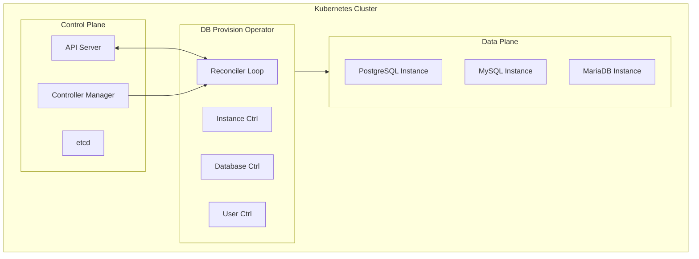
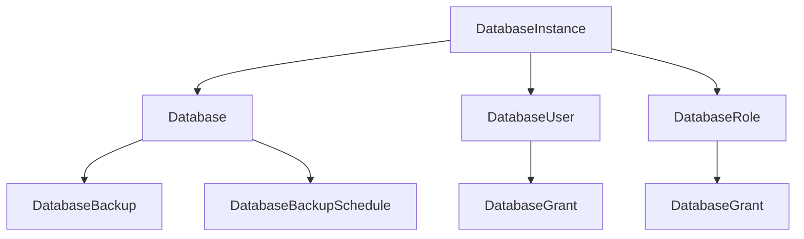

# Architecture

Overview of DB Provision Operator's architecture and design.

## Overview

DB Provision Operator follows the Kubernetes Operator pattern, using Custom Resource Definitions (CRDs) to extend the Kubernetes API with database-specific resources.

## Core Components

### Controllers

Each CRD has a dedicated controller:

| Controller | Responsibility |
|------------|----------------|
| DatabaseInstance | Connection management, health checks |
| Database | Database lifecycle, extensions, schemas |
| DatabaseUser | User management, credential generation |
| DatabaseRole | Role management, permission grouping |
| DatabaseGrant | Permission management |
| DatabaseBackup | Backup execution |
| DatabaseBackupSchedule | Scheduled backup management |
| DatabaseRestore | Restore execution |

### Reconciliation Loop

## Resource Hierarchy

### Dependencies

| Resource | Depends On |
|----------|------------|
| Database | DatabaseInstance |
| DatabaseUser | DatabaseInstance |
| DatabaseRole | DatabaseInstance |
| DatabaseGrant | DatabaseUser OR DatabaseRole |
| DatabaseBackup | Database |
| DatabaseBackupSchedule | Database |
| DatabaseRestore | DatabaseBackup, Database |

## Design Principles

### 1. Declarative Management

Resources are declared in YAML; the operator reconciles actual state to match desired state.

### 2. Idempotency

Reconciliation can run multiple times safely without side effects.

### 3. Eventually Consistent

The operator continuously reconciles until desired state is achieved.

### 4. Fail-Safe

Errors are logged and retried; resources maintain last known good state.

### 5. Secure by Default

- Credentials are stored in Kubernetes Secrets
- TLS connections supported
- Minimum required permissions

## Next Steps

- [Design Decisions](design.md) - Detailed design rationale
- [Security](security.md) - Security architecture
