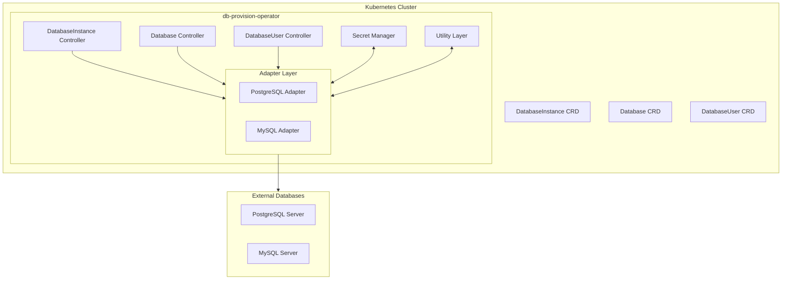
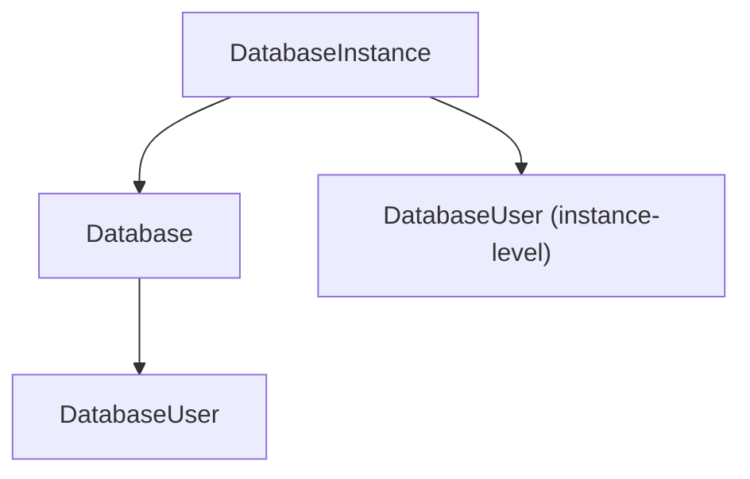
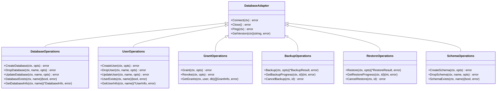
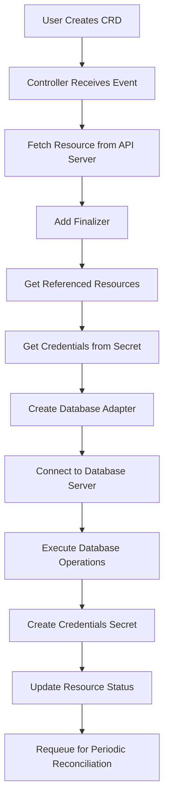
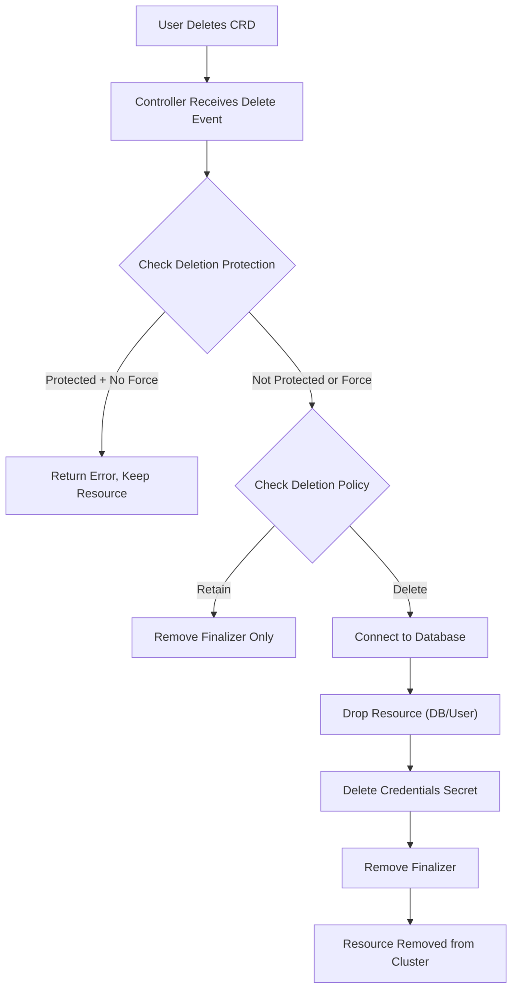

# System Overview

## Introduction

The **db-provision-operator** is a Kubernetes operator designed to provide unified database management across multiple database engines. It enables declarative management of database servers, databases, users, and access controls through Kubernetes Custom Resource Definitions (CRDs).

## Project Goals

1. **Unified Database Management**: Provide a consistent API for managing databases across different engines (PostgreSQL, MySQL, and future engines)
2. **Kubernetes-Native**: Leverage Kubernetes patterns (controllers, CRDs, finalizers) for lifecycle management
3. **Security-First**: Secure credential management with automatic password generation and secret templating
4. **Production-Ready**: Support for TLS/mTLS, health checks, deletion protection, and graceful cleanup
5. **Extensibility**: Adapter-based architecture for easy addition of new database engines

## High-Level Architecture



## Technology Stack

| Component | Technology | Version |
|-----------|------------|---------|
| Operator Framework | Operator SDK | v1.42.0 |
| Kubernetes Client | controller-runtime | Latest |
| PostgreSQL Driver | pgx/v5 | v5.x |
| MySQL Driver | go-sql-driver/mysql | v1.x |
| Go Version | Go | 1.21+ |

## Custom Resource Definitions (CRDs)

### Primary Resources

| CRD | API Group | Description |
|-----|-----------|-------------|
| `DatabaseInstance` | `dbops.dbprovision.io/v1alpha1` | Represents a database server connection |
| `Database` | `dbops.dbprovision.io/v1alpha1` | Represents a database within an instance |
| `DatabaseUser` | `dbops.dbprovision.io/v1alpha1` | Represents a database user/role |
| `DatabaseRole` | `dbops.dbprovision.io/v1alpha1` | Represents a permission group |
| `DatabaseGrant` | `dbops.dbprovision.io/v1alpha1` | Represents fine-grained access control |
| `DatabaseBackup` | `dbops.dbprovision.io/v1alpha1` | Represents a backup operation |
| `DatabaseBackupSchedule` | `dbops.dbprovision.io/v1alpha1` | Represents scheduled backups |
| `DatabaseRestore` | `dbops.dbprovision.io/v1alpha1` | Represents a restore operation |

### Resource Hierarchy



## Component Architecture

### Controllers Layer

Controllers implement the reconciliation loop pattern, watching CRD resources and ensuring the actual state matches the desired state.

#### DatabaseInstance Controller
```
Responsibilities:
├── Validate database server connectivity
├── Perform periodic health checks
├── Maintain connection status in status field
└── Handle graceful deletion (finalizer cleanup)
```

#### Database Controller
```
Responsibilities:
├── Create databases on target instance
├── Configure database settings (encoding, collation, extensions)
├── Manage database lifecycle
└── Drop database on deletion (if policy allows)
```

#### DatabaseUser Controller
```
Responsibilities:
├── Create database users/roles
├── Manage passwords (generate or use existing)
├── Create credentials secrets
├── Configure user attributes and grants
└── Drop user on deletion (if policy allows)
```

### Adapter Layer

The adapter layer provides a unified interface for database operations across different engines.

#### Interface Hierarchy


### Secret Manager

```
Package: internal/secret

Responsibilities:
├── Retrieve credentials from Kubernetes Secrets
├── Retrieve TLS certificates from Secrets
├── Generate cryptographically secure passwords
├── Create/update/delete Secrets with owner references
├── Render secret templates with database connection info
└── Support configurable key names for credentials
```

## Data Flow

### Resource Creation Flow


### Resource Deletion Flow


## Project Structure

```
db-provision-operator/
├── api/v1alpha1/           # CRD type definitions
├── cmd/main.go             # Operator entrypoint
├── config/                 # Kubernetes manifests
│   ├── crd/               # Generated CRD manifests
│   ├── rbac/              # RBAC configuration
│   └── samples/           # Example resources
├── internal/
│   ├── adapter/           # Database adapters
│   │   ├── postgres/      # PostgreSQL implementation
│   │   ├── mysql/         # MySQL implementation
│   │   └── types/         # Shared adapter types
│   ├── controller/        # Kubernetes controllers
│   ├── secret/            # Secret management
│   └── util/              # Utility functions
└── docs/                  # Project documentation
```

## Supported Database Engines

### PostgreSQL
- Full support for database operations (create, drop, update)
- User/role management with all PostgreSQL attributes
- Schema-level and default privileges
- Extensions management
- Backup/restore using pg_dump and pg_restore

### MySQL
- Database operations with charset/collation support
- User management with resource limits and authentication plugins
- Grant management at multiple levels (global, database, table, column, routine)
- Backup/restore using mysqldump
