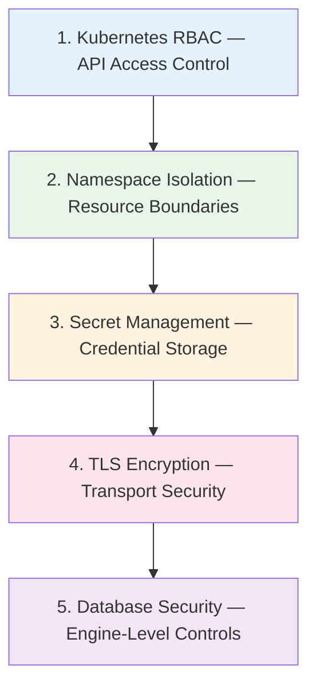

# Security

Security architecture and best practices.

## Overview

DB Provision Operator implements multiple security layers:



## Kubernetes RBAC

### Operator Service Account

The operator runs with minimal permissions:

```yaml
apiVersion: rbac.authorization.k8s.io/v1
kind: ClusterRole
metadata:
  name: db-provision-operator
rules:
  # CRD management
  - apiGroups: ["dbops.dbprovision.io"]
    resources: ["*"]
    verbs: ["*"]
  # Secret read/write for credentials
  - apiGroups: [""]
    resources: ["secrets"]
    verbs: ["get", "list", "watch", "create", "update", "patch", "delete"]
  # Events for status reporting
  - apiGroups: [""]
    resources: ["events"]
    verbs: ["create", "patch"]
  # Jobs for backup/restore
  - apiGroups: ["batch"]
    resources: ["jobs"]
    verbs: ["get", "list", "watch", "create", "delete"]
```

### User RBAC

Grant users access to specific resources:

```yaml
# Developer role - manage own databases
apiVersion: rbac.authorization.k8s.io/v1
kind: Role
metadata:
  name: database-developer
  namespace: app-namespace
rules:
  - apiGroups: ["dbops.dbprovision.io"]
    resources: ["databases", "databaseusers", "databasegrants"]
    verbs: ["get", "list", "watch", "create", "update", "patch", "delete"]
  - apiGroups: [""]
    resources: ["secrets"]
    verbs: ["get", "list"]
    resourceNames: ["*-credentials"]  # Only credential secrets
```

```yaml
# Admin role - manage instances
apiVersion: rbac.authorization.k8s.io/v1
kind: Role
metadata:
  name: database-admin
  namespace: database-namespace
rules:
  - apiGroups: ["dbops.dbprovision.io"]
    resources: ["*"]
    verbs: ["*"]
  - apiGroups: [""]
    resources: ["secrets"]
    verbs: ["*"]
```

## Namespace Isolation

### Single-Namespace Mode

Resources only access same-namespace DatabaseInstances:

```yaml
apiVersion: dbops.dbprovision.io/v1alpha1
kind: Database
metadata:
  name: myapp
  namespace: app-team-a
spec:
  instanceRef:
    name: postgres-primary
    # No namespace = same namespace (app-team-a)
```

### Cross-Namespace Mode

Reference instances in other namespaces:

```yaml
apiVersion: dbops.dbprovision.io/v1alpha1
kind: Database
metadata:
  name: myapp
  namespace: app-team-a
spec:
  instanceRef:
    name: shared-postgres
    namespace: database  # Different namespace
```

**Required RBAC for cross-namespace:**

```yaml
# In database namespace
apiVersion: rbac.authorization.k8s.io/v1
kind: Role
metadata:
  name: instance-reader
  namespace: database
rules:
  - apiGroups: ["dbops.dbprovision.io"]
    resources: ["databaseinstances"]
    verbs: ["get", "list", "watch"]
---
# Bind to app-team-a service account
apiVersion: rbac.authorization.k8s.io/v1
kind: RoleBinding
metadata:
  name: app-team-a-instance-reader
  namespace: database
roleRef:
  apiGroup: rbac.authorization.k8s.io
  kind: Role
  name: instance-reader
subjects:
  - kind: ServiceAccount
    name: default
    namespace: app-team-a
```

## Secret Management

### Credential Storage

All database credentials are stored in Kubernetes Secrets:

```yaml
apiVersion: v1
kind: Secret
metadata:
  name: myapp-user-credentials
  ownerReferences:
    - apiVersion: dbops.dbprovision.io/v1alpha1
      kind: DatabaseUser
      name: myapp-user
type: Opaque
data:
  username: <base64>
  password: <base64>
```

### Secret Best Practices

1. **Enable encryption at rest:**
   ```yaml
   # kube-apiserver configuration
   --encryption-provider-config=/etc/kubernetes/enc/enc.yaml
   ```

2. **Use external secret management:**
   - HashiCorp Vault with External Secrets Operator
   - AWS Secrets Manager
   - Azure Key Vault

3. **Limit Secret access:**
   ```yaml
   # Only allow specific secret access
   rules:
     - apiGroups: [""]
       resources: ["secrets"]
       resourceNames: ["postgres-admin-credentials"]
       verbs: ["get"]
   ```

### Password Generation

Secure password generation:

```yaml
passwordSecret:
  generate: true
  length: 32
  includeSpecialChars: true
  excludeChars: "\"'\\`"  # Exclude problematic characters
```

## TLS Encryption

### PostgreSQL TLS

```yaml
apiVersion: dbops.dbprovision.io/v1alpha1
kind: DatabaseInstance
metadata:
  name: postgres-tls
spec:
  engine: postgres
  connection:
    host: postgres.database.svc.cluster.local
    port: 5432
    sslMode: verify-full
    secretRef:
      name: postgres-admin-credentials
    tls:
      secretRef:
        name: postgres-tls-certs
        keys:
          ca: ca.crt
          cert: tls.crt
          key: tls.key
```

### MySQL TLS

```yaml
apiVersion: dbops.dbprovision.io/v1alpha1
kind: DatabaseInstance
metadata:
  name: mysql-tls
spec:
  engine: mysql
  connection:
    host: mysql.database.svc.cluster.local
    port: 3306
    secretRef:
      name: mysql-admin-credentials
    tls:
      enabled: true
      secretRef:
        name: mysql-tls-certs
```

### Certificate Management

Use cert-manager for automated certificate management:

```yaml
apiVersion: cert-manager.io/v1
kind: Certificate
metadata:
  name: postgres-client-cert
spec:
  secretName: postgres-tls-certs
  issuerRef:
    name: database-ca
    kind: ClusterIssuer
  commonName: postgres-client
  usages:
    - client auth
```

## Database Security

### PostgreSQL Security

```yaml
# User with minimum privileges
apiVersion: dbops.dbprovision.io/v1alpha1
kind: DatabaseUser
metadata:
  name: app-user
spec:
  instanceRef:
    name: postgres-primary
  username: app_user
  postgres:
    login: true
    inherit: true
    createDB: false
    createRole: false
    superuser: false
    replication: false
    bypassRLS: false
    connectionLimit: 20
```

### MySQL Security

```yaml
apiVersion: dbops.dbprovision.io/v1alpha1
kind: DatabaseUser
metadata:
  name: app-user
spec:
  instanceRef:
    name: mysql-primary
  username: app_user
  mysql:
    maxUserConnections: 20
    authPlugin: caching_sha2_password
    requireSSL: true
    allowedHosts:
      - "10.0.0.%"  # Only internal network
```

## Backup Security

### Encrypted Backups

```yaml
apiVersion: dbops.dbprovision.io/v1alpha1
kind: DatabaseBackup
metadata:
  name: secure-backup
spec:
  databaseRef:
    name: myapp-database
  storage:
    type: s3
    s3:
      bucket: secure-backups
      secretRef:
        name: s3-credentials
  encryption:
    enabled: true
    algorithm: aes-256-gcm
    secretRef:
      name: backup-encryption-key
      key: encryption-key
```

### S3 Security

```yaml
# S3 bucket policy for backup storage
{
  "Version": "2012-10-17",
  "Statement": [
    {
      "Effect": "Allow",
      "Principal": {"AWS": "arn:aws:iam::ACCOUNT:role/backup-role"},
      "Action": ["s3:PutObject", "s3:GetObject", "s3:DeleteObject"],
      "Resource": "arn:aws:s3:::secure-backups/*"
    }
  ]
}
```

## Network Security

### Network Policies

Restrict operator network access:

```yaml
apiVersion: networking.k8s.io/v1
kind: NetworkPolicy
metadata:
  name: db-provision-operator
  namespace: db-provision-operator-system
spec:
  podSelector:
    matchLabels:
      app: db-provision-operator
  policyTypes:
    - Egress
  egress:
    # Allow DNS
    - to:
        - namespaceSelector: {}
      ports:
        - protocol: UDP
          port: 53
    # Allow database connections
    - to:
        - namespaceSelector:
            matchLabels:
              name: database
      ports:
        - protocol: TCP
          port: 5432
        - protocol: TCP
          port: 3306
    # Allow Kubernetes API
    - to:
        - ipBlock:
            cidr: 10.0.0.1/32  # API server IP
      ports:
        - protocol: TCP
          port: 443
```

## Security Checklist

### Deployment

- [ ] Operator runs with minimal RBAC permissions
- [ ] Pod security context configured (non-root)
- [ ] Resource limits set
- [ ] Network policies in place

### Secrets

- [ ] Encryption at rest enabled
- [ ] Secret access restricted by RBAC
- [ ] Password generation uses strong defaults
- [ ] No secrets in container environment variables

### Connections

- [ ] TLS enabled for database connections
- [ ] SSL mode set to `verify-full` (PostgreSQL)
- [ ] Client certificates used where possible

### Database

- [ ] Users have minimum required privileges
- [ ] Connection limits configured
- [ ] Host restrictions set (MySQL)
- [ ] Deletion protection enabled for production

### Backups

- [ ] Backup encryption enabled
- [ ] Storage credentials secured
- [ ] Backup retention policies configured
- [ ] Regular restore testing performed
