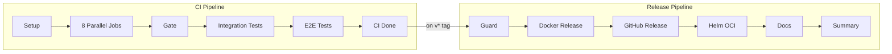

# CI/CD

Continuous integration and deployment pipeline for the DB Provision Operator.

## Overview

The pipeline uses two workflows:

1. **CI** (`ci.yml`) — Runs the full test suite on every push to `main`, every PR, and every tag push (`v*`)
2. **Release** (`release.yml`) — Triggered automatically when CI completes on a `v*` tag, or manually via `workflow_dispatch`



### Triggers

| Event | Branches/Tags | What Runs |
|-------|---------------|-----------|
| Pull request | `main` | CI Stages 0–5 (Docker build without push) |
| Push | `main` | CI Stages 0–5 + Docker push + Security scan |
| Tag | `v*` | CI Stages 0–5 (full pipeline) → Release (automatic) |
| Manual | `workflow_dispatch` | Release only (with tag input) |

### Release Flow

```
git tag v0.1.8 && git push origin v0.1.8
  └─► CI runs full pipeline (lint, test, envtest, integration, E2E)
       └─► CI succeeds → workflow_run triggers Release
            └─► Guard validates tag + Chart.yaml version match
                 └─► Docker retag (sha-xxx → version + latest)
                 └─► GitHub Release (install.yaml, CRDs, Helm chart, checksums, SBOMs)
                 └─► Helm OCI push (oci://ghcr.io/<owner>/charts/db-provision-operator)
                 └─► Documentation deploy (GitHub Pages)
```

## CI Workflow

### Stage 1: Parallel Jobs

Eight jobs run concurrently after setup:

#### 1. Lint

Runs `golangci-lint` (v2.1.0) via the official GitHub Action.

#### 2. Unit Tests

```bash
make test  # go test (excludes /e2e), outputs cover.out
```

Uploads coverage to Codecov.

#### 3. Controller Tests (envtest)

```bash
make test-envtest  # Runs controller + CRD validation tests with envtest
```

Uses `KUBEBUILDER_ASSETS` from `setup-envtest`. Envtest binaries (~100MB) are cached by Kubernetes version.

#### 4. Template Comparison

```bash
make test-templates  # Verifies Helm ≡ Kustomize template equivalence
```

Ensures the Helm chart and Kustomize overlays produce equivalent manifests.

#### 5. Docker Build

Builds the operator image per platform (currently `linux/amd64`). Uses a multi-layer cache strategy:

- **GHA cache** (fast, per-platform, workflow-local)
- **Registry cache** (persistent fallback when GHA cache is evicted)

On **push events**: Pushes by digest, uploads digest artifact for manifest merging.
On **PRs**: Builds locally, saves as tarball artifact for E2E tests.

#### 6. Verify Manifests

```bash
make manifests  # Generates CRDs, RBAC, webhook configs
```

On `main` push: auto-commits if manifests are outdated.
On PRs: fails the check so the developer runs `make manifests` locally.

Also runs Helm chart linting, template rendering, and strict YAML validation (duplicate key detection).

#### 7. Verify Generated Code

```bash
make generate  # Generates DeepCopy methods
```

Fails if generated code is outdated.

#### 8. Docs Build

```bash
mkdocs build --strict  # Builds documentation, fails on warnings
```

### Stage 2: Gate

Waits for all Stage 1 jobs to succeed before allowing integration tests. Checks each job's result and fails with a clear error message identifying which job(s) failed.

For PRs, `docker-merge` is skipped (no push), so the gate only checks `docker-build`.

### Stage 3: Integration Tests

Runs after the gate passes. Uses a matrix strategy across all four database engines:

```yaml
matrix:
  database: [postgresql, mysql, mariadb, cockroachdb]
```

Each job uses **testcontainers-go** to manage Docker containers programmatically — no manual container setup needed. The tests run against real database instances with envtest providing the Kubernetes API.

```bash
make test-integration INTEGRATION_TEST_DATABASE=${{ matrix.database }}
```

### Stage 4: E2E Tests

Runs after integration tests pass. Full end-to-end validation using Docker Compose + k3d + Helm.

#### Pipeline Per Database (16 Steps)

Each database engine runs in parallel with this sequence:

| # | Step | Description |
|---|------|-------------|
| 1 | Checkout | Clone repository |
| 2 | Setup Go | Install Go from `go.mod` version |
| 3 | Get SHA | Short commit SHA for image tagging |
| 4 | Install k3d | Install k3d CLI |
| 5 | Start database | `make e2e-db-up E2E_DATABASE=<engine>` |
| 6 | Create cluster | `make e2e-cluster-create` |
| 7 | Get operator image | Pull from registry (push) or load from artifact (PR) |
| 8 | Load into k3d | `make e2e-image-load E2E_IMG=<image>` |
| 9 | Install CRDs | `make e2e-install-crds` |
| 10 | Install Helm | Setup Helm v3.14.0 |
| 11 | Deploy operator | `helm install` with the chart (not Kustomize) |
| 12 | Wait for ready | `kubectl wait --for=condition=Available` |
| 13 | Create instance | `make e2e-create-db-instance E2E_DATABASE=<engine>` |
| 14 | Run tests | `make e2e-local-run-tests E2E_DATABASE=<engine>` |
| 15 | Collect logs | On failure: operator logs, pod descriptions, Docker Compose logs, CR YAML, events |
| 16 | Cleanup | `make e2e-local-cleanup` (always runs) |

#### Helm Deployment (Not Kustomize)

CI intentionally deploys the operator via the **Helm chart** (`charts/db-provision-operator/`) rather than Kustomize. This validates the Helm chart in a real cluster as part of every CI run. Local development uses `make e2e-deploy-operator` (Kustomize) for faster iteration.

#### Log Collection on Failure

When any E2E step fails, CI collects:

- Operator pod logs (last 500 lines)
- Operator pod description
- Docker Compose database logs (last 100 lines)
- All database-related CR YAML dumps
- Kubernetes events (last 100)
- Pod list across all namespaces

### Stage 5: CI Success

A summary job that runs after all E2E tests pass. Confirms the full pipeline succeeded.

### Security Scan (Push Events Only)

After `docker-merge`, Trivy scans each platform image:

1. **Generate CycloneDX SBOM** from the container image
2. **Scan for vulnerabilities** — outputs JSON (all severities) + table (MEDIUM+ with unfixed ignored)
3. **Generate SARIF report** — uploaded to GitHub Security tab via CodeQL
4. **Upload artifacts** — SBOM, vulnerability reports retained for 30 days

## Release Workflow

The release workflow uses the `workflow_run` pattern: it triggers automatically when the CI workflow completes, but only proceeds if CI succeeded and the trigger was a `v*` semver tag.

### Guard Job

The guard job gates all downstream release jobs:

1. **Checks CI conclusion** — fails immediately if CI didn't succeed
2. **Extracts tag** — from `workflow_run.head_branch` (automatic) or `inputs.tag` (manual dispatch)
3. **Validates semver** — skips release for non-version tags (e.g., plain push to main)
4. **Validates Chart.yaml** — ensures chart version matches the tag version
5. **Computes image tag** — derives the `sha-<short>` tag used by CI for Docker retagging
6. **Stores CI run ID** — used for cross-workflow artifact download (SBOMs)

### Docker Release

- **Automatic (workflow_run)**: Retags the CI-built `sha-xxx` image to `<version>` and `latest` using `docker buildx imagetools create`. This is a manifest-only operation — no rebuild, bit-for-bit identical to what CI tested.
- **Manual (workflow_dispatch)**: Rebuilds from source as a fallback when no CI-built image exists.

### GitHub Release

Creates a GitHub Release with the following assets:

| Asset | Description |
|-------|-------------|
| `db-provision-operator-<ver>.yaml` | Versioned Kustomize install manifest |
| `crds-<ver>.tar.gz` | CRD definitions tarball |
| `db-provision-operator-<ver>.tgz` | Helm chart package |
| `checksums.txt` | SHA-256 checksums for all artifacts |
| `sbom.spdx.json` | SBOM from CI (when available) |

Tags containing `-rc`, `-alpha`, or `-beta` are marked as pre-releases.

### Helm OCI

Pushes the Helm chart as an OCI artifact to the GitHub Container Registry:

```bash
# Install the operator via OCI
helm install db-provision-operator \
  oci://ghcr.io/<owner>/charts/db-provision-operator \
  --version <version>
```

No gh-pages Helm repository is needed — images and charts use the same container registry.

### Documentation Deploy

Builds documentation with mkdocs-material and deploys to GitHub Pages via `mkdocs gh-deploy --force`.

### Manual Dispatch

The release can be triggered manually via `workflow_dispatch` with a tag input. This bypasses the `workflow_run` trigger and rebuilds Docker images from source. Useful for re-releasing or releasing from an existing tag when CI artifacts have expired.

```bash
gh workflow run release.yml -f tag=v0.1.8
```

## Docker Image Build

### Multi-Stage Dockerfile

The operator image uses a multi-stage build:

1. **Builder stage**: Compiles the Go binary
2. **Runtime stage**: Alpine-based minimal image with database client tools

### Image Tags

| Tag Pattern | When | Example |
|-------------|------|---------|
| `sha-<short>` | Every build | `sha-abc1234` |
| `latest` | Push to main / release | `latest` |
| `main` | Push to main | `main` |
| `<version>` | Semver tag | `1.2.3` |
| `<major>.<minor>` | Semver tag | `1.2` |

### Cache Strategy

```
GHA cache (fast, per-platform)
  └── fallback: Registry cache (persistent, cross-workflow)
```

PRs share cache from the `main` branch via registry cache, enabling fast builds even on new branches.

## Build Artifacts

### Container Images

Published to: `ghcr.io/<owner>/db-provision-operator`

### Helm Charts

Published as OCI artifacts to: `oci://ghcr.io/<owner>/charts/db-provision-operator`

### SBOM

Generated in two formats:

- **SPDX** (via `anchore/sbom-action`) — uploaded as artifact, attached to GitHub releases
- **CycloneDX** (via Trivy) — used for vulnerability scanning

## Environment Configuration

### Secrets

| Secret | Purpose |
|--------|---------|
| `GITHUB_TOKEN` | Auto-provided — registry login, release creation |
| `CODECOV_TOKEN` | Coverage reporting |

### Global Environment

| Variable | Value | Description |
|----------|-------|-------------|
| `GO_VERSION_FILE` | `go.mod` | Go version source of truth |
| `REGISTRY` | `ghcr.io` | Container registry |
| `IMAGE_NAME` | `${{ github.repository }}` | Image name |

## Local CI Simulation

Reproduce each CI stage locally:

```bash
# Stage 1: Lint
make lint

# Stage 1: Unit tests
make test

# Stage 1: Controller tests (envtest)
make test-envtest

# Stage 1: Template comparison
make test-templates

# Stage 1: Docker build
make docker-build

# Stage 1: Manifests
make manifests && git diff --exit-code

# Stage 1: Generated code
make generate && git diff --exit-code

# Stage 1: Docs
mkdocs build --strict

# Stage 3: Integration tests (single engine)
make test-integration INTEGRATION_TEST_DATABASE=postgresql

# Stage 4: E2E tests (single engine)
make e2e-local-postgresql

# Full E2E (all engines)
make e2e-local-all
```
