# Cross-Namespace RBAC

This document explains how the db-provision-operator supports cross-namespace Secret references and the RBAC configuration that enables this feature.

## Overview

The db-provision-operator uses **ClusterRole** and **ClusterRoleBinding** (not namespace-scoped Role/RoleBinding) to enable cross-namespace access to Secrets. This allows:

- A `DatabaseInstance` in namespace A to reference a Secret in namespace B
- Centralized credential management in a dedicated namespace
- Separation of concerns between application teams and database administrators

## Architecture

```mermaid
graph LR
    subgraph AppNS["Namespace: app"]
        DI["DatabaseInstance\nname: prod-db\nsecretRef → db-secrets"]
    end
    subgraph SecNS["Namespace: db-secrets"]
        S1["Secret: pg-credentials\nusername: admin"]
        S2["Secret: mysql-creds\nusername: root"]
    end
    subgraph SysNS["db-provision-operator-system"]
        POD["controller-manager Pod"] --> SA["ServiceAccount\n+ ClusterRoleBinding\n+ ClusterRole"]
    end
    DI -->|refs| S1
    POD -->|watches all namespaces| DI
    POD -->|reads secrets globally| S1
    POD -->|reads secrets globally| S2
```



## RBAC Configuration

### ClusterRole

The operator's ClusterRole (`config/rbac/role.yaml`) includes permissions to access Secrets across all namespaces:

```yaml
apiVersion: rbac.authorization.k8s.io/v1
kind: ClusterRole
metadata:
  name: manager-role
rules:
  - apiGroups:
      - ""
    resources:
      - secrets
    verbs:
      - get
      - list
      - watch
      - create
      - update
      - patch
      - delete
```

### ClusterRoleBinding

The ClusterRoleBinding (`config/rbac/role_binding.yaml`) binds the ClusterRole to the operator's ServiceAccount:

```yaml
apiVersion: rbac.authorization.k8s.io/v1
kind: ClusterRoleBinding
metadata:
  name: manager-rolebinding
roleRef:
  apiGroup: rbac.authorization.k8s.io
  kind: ClusterRole
  name: manager-role
subjects:
  - kind: ServiceAccount
    name: controller-manager
    namespace: db-provision-operator-system
```

**Key Point**: Using `ClusterRoleBinding` (not `RoleBinding`) grants the operator cluster-wide permissions, enabling cross-namespace Secret access.

## Usage Examples

### Example 1: DatabaseInstance with Cross-Namespace Secret

```yaml
# Secret in dedicated credentials namespace
apiVersion: v1
kind: Namespace
metadata:
  name: db-credentials
---
apiVersion: v1
kind: Secret
metadata:
  name: postgres-admin
  namespace: db-credentials
type: Opaque
stringData:
  username: postgres
  password: supersecretpassword

---
# DatabaseInstance in application namespace referencing cross-namespace Secret
apiVersion: dbops.dbprovision.io/v1alpha1
kind: DatabaseInstance
metadata:
  name: production-postgres
  namespace: my-app  # Different from Secret namespace
spec:
  engine: postgresql
  connection:
    host: postgres.database.svc.cluster.local
    port: 5432
    database: postgres
    secretRef:
      name: postgres-admin
      namespace: db-credentials  # Cross-namespace reference
  healthCheck:
    enabled: true
    interval: 30s
```

### Example 2: Centralized Credential Management

```yaml
# Central secrets namespace with all database credentials
apiVersion: v1
kind: Namespace
metadata:
  name: database-secrets
  labels:
    purpose: credential-storage
---
# PostgreSQL credentials
apiVersion: v1
kind: Secret
metadata:
  name: prod-postgresql
  namespace: database-secrets
type: Opaque
stringData:
  username: admin
  password: pg-secret-123
---
# MySQL credentials
apiVersion: v1
kind: Secret
metadata:
  name: prod-mysql
  namespace: database-secrets
type: Opaque
stringData:
  username: root
  password: mysql-secret-456

---
# Team A's PostgreSQL instance
apiVersion: dbops.dbprovision.io/v1alpha1
kind: DatabaseInstance
metadata:
  name: team-a-postgres
  namespace: team-a
spec:
  engine: postgresql
  connection:
    host: postgres.prod.svc.cluster.local
    port: 5432
    database: postgres
    secretRef:
      name: prod-postgresql
      namespace: database-secrets  # Points to central namespace

---
# Team B's MySQL instance
apiVersion: dbops.dbprovision.io/v1alpha1
kind: DatabaseInstance
metadata:
  name: team-b-mysql
  namespace: team-b
spec:
  engine: mysql
  connection:
    host: mysql.prod.svc.cluster.local
    port: 3306
    database: mysql
    secretRef:
      name: prod-mysql
      namespace: database-secrets  # Points to central namespace
```

## Security Considerations

### Principle of Least Privilege

While the operator has cluster-wide Secret access, you should:

1. **Limit Secret creation** - Use Kubernetes RBAC to control who can create Secrets in credential namespaces
2. **Audit Secret access** - Enable Kubernetes audit logging to track Secret access
3. **Use dedicated namespaces** - Create dedicated namespaces for database credentials with restricted access

### Restricting Secret Access (Optional)

If you want to restrict which namespaces the operator can access Secrets from, you can use multiple RoleBindings instead of ClusterRoleBinding:

```yaml
# Create Role in each namespace where secrets should be accessible
apiVersion: rbac.authorization.k8s.io/v1
kind: Role
metadata:
  name: secret-reader
  namespace: db-credentials
rules:
  - apiGroups: [""]
    resources: ["secrets"]
    verbs: ["get", "list", "watch"]
---
apiVersion: rbac.authorization.k8s.io/v1
kind: RoleBinding
metadata:
  name: operator-secret-access
  namespace: db-credentials
roleRef:
  apiGroup: rbac.authorization.k8s.io
  kind: Role
  name: secret-reader
subjects:
  - kind: ServiceAccount
    name: controller-manager
    namespace: db-provision-operator-system
```

**Trade-off**: This approach requires creating RoleBindings in each namespace where Secrets should be accessible, but provides finer-grained access control.

## Verifying RBAC Configuration

### Check ClusterRoleBinding

```bash
kubectl get clusterrolebinding manager-rolebinding -o yaml
```

Expected output should show:
- `kind: ClusterRoleBinding` (not RoleBinding)
- `roleRef.kind: ClusterRole`
- ServiceAccount reference to the operator

### Test Cross-Namespace Access

```bash
# Create a test secret in a separate namespace
kubectl create namespace test-secrets
kubectl create secret generic test-creds \
  --from-literal=username=testuser \
  --from-literal=password=testpass \
  -n test-secrets

# Create a DatabaseInstance referencing the cross-namespace secret
cat <<EOF | kubectl apply -f -
apiVersion: dbops.dbprovision.io/v1alpha1
kind: DatabaseInstance
metadata:
  name: test-cross-ns
  namespace: default
spec:
  engine: postgresql
  connection:
    host: postgres.postgres.svc.cluster.local
    port: 5432
    database: postgres
    secretRef:
      name: test-creds
      namespace: test-secrets  # Different namespace
EOF

# Check if the DatabaseInstance becomes Ready
kubectl get databaseinstance test-cross-ns -o jsonpath='{.status.phase}'
# Expected: "Ready" (if database is accessible)

# Cleanup
kubectl delete databaseinstance test-cross-ns
kubectl delete namespace test-secrets
```

## Troubleshooting

### Error: "secrets is forbidden"

**Symptom**: Operator logs show `secrets "xxx" is forbidden: User "system:serviceaccount:..." cannot get resource "secrets" in API group "" in the namespace "yyy"`

**Solution**:
1. Verify ClusterRoleBinding exists:
   ```bash
   kubectl get clusterrolebinding manager-rolebinding
   ```
2. Check the binding references the correct ServiceAccount:
   ```bash
   kubectl get clusterrolebinding manager-rolebinding -o yaml
   ```
3. Reinstall RBAC:
   ```bash
   make install
   make deploy IMG=<your-image>
   ```

### DatabaseInstance stuck in Pending

**Symptom**: DatabaseInstance never becomes Ready when using cross-namespace Secret

**Solution**:
1. Check operator logs for errors
2. Verify the Secret exists in the referenced namespace
3. Verify the Secret has the required keys (`username`, `password`)
4. Test direct Secret access:
   ```bash
   kubectl auth can-i get secrets --as=system:serviceaccount:db-provision-operator-system:controller-manager -n <secret-namespace>
   ```
