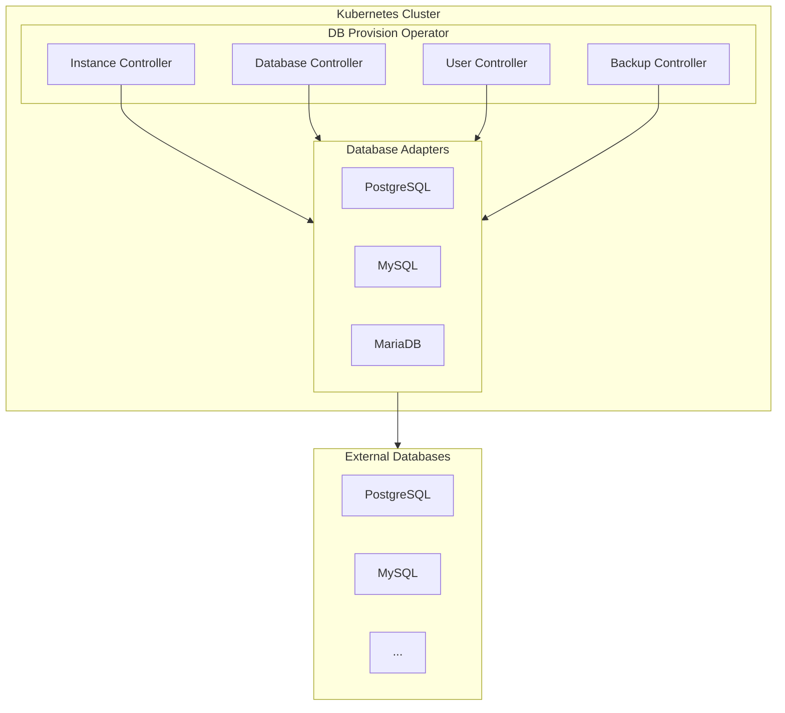

# Getting Started

Welcome to DB Provision Operator! This section will help you get up and running quickly.

## What is DB Provision Operator?

DB Provision Operator is a Kubernetes operator that enables declarative management of database resources. It supports:

- **PostgreSQL** - Full support including extensions, schemas, and roles
- **MySQL** - Including authentication plugins and charset configuration
- **MariaDB** - MySQL-compatible with MariaDB-specific features

## Prerequisites

Before installing DB Provision Operator, ensure you have:

- **Kubernetes cluster** version 1.26 or higher
- **kubectl** configured to communicate with your cluster
- **Helm 3.x** (if using Helm installation)
- **Database server** accessible from the cluster (PostgreSQL, MySQL, or MariaDB)

## Installation Methods

Choose your preferred installation method:

| Method | Best For | Customization |
|--------|----------|---------------|
| [Helm](installation.md#helm-installation) | Production deployments | Full control via values.yaml |
| [Kustomize](installation.md#kustomize-installation) | GitOps workflows | Patch-based customization |

## Quick Links

- [Installation Guide](installation.md) - Detailed installation instructions
- [Quick Start Tutorial](quickstart.md) - Create your first database in 5 minutes
- [Examples](../examples/index.md) - Ready-to-use YAML examples

## Architecture Overview

## Next Steps

1. **[Install the operator](installation.md)** in your cluster
2. **[Follow the quick start](quickstart.md)** to create your first database
3. **[Explore the user guide](../user-guide/index.md)** for advanced features
