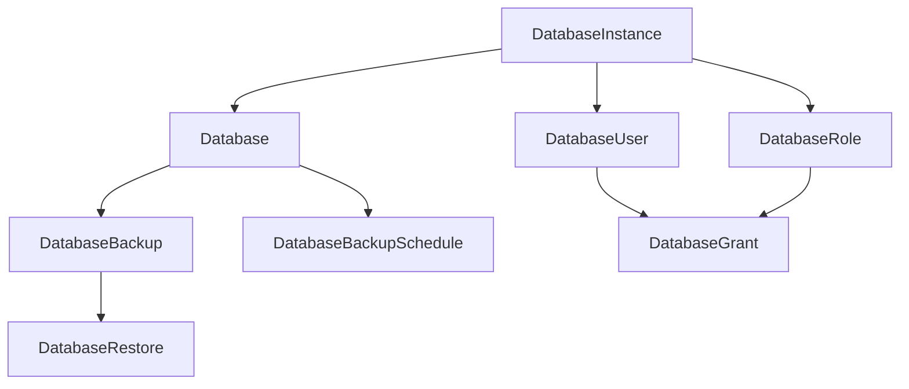

# User Guide

This guide covers all Custom Resource Definitions (CRDs) provided by DB Provision Operator.

## Resource Hierarchy



## CRD Overview

| CRD | Description | Depends On |
|-----|-------------|------------|
| [DatabaseInstance](database-instances.md) | Connection to a database server | - |
| [Database](databases.md) | Logical database | DatabaseInstance |
| [DatabaseUser](users.md) | Database user with credentials | DatabaseInstance |
| [DatabaseRole](roles.md) | Group role for permissions | DatabaseInstance |
| [DatabaseGrant](grants.md) | Permission assignments | DatabaseUser, DatabaseRole |
| [DatabaseBackup](backups.md) | One-time backup | Database |
| DatabaseBackupSchedule | Scheduled backups | Database |
| DatabaseRestore | Restore from backup | DatabaseBackup |

## Common Patterns

### Resource Naming

All resources support a `name` field in the spec that defines the actual database object name (e.g., database name, username). If not specified, the Kubernetes resource name is used.

```yaml
apiVersion: dbops.dbprovision.io/v1alpha1
kind: Database
metadata:
  name: my-k8s-resource-name  # Kubernetes resource name
spec:
  name: actual_database_name  # Database name (optional, defaults to metadata.name)
```

### Instance References

Child resources reference their parent `DatabaseInstance`:

```yaml
spec:
  instanceRef:
    name: postgres-primary
    namespace: default  # Optional, defaults to same namespace
```

### Deletion Policies

Resources that create external database objects support deletion policies:

| Policy | Behavior |
|--------|----------|
| `Retain` | Keep the database object when CR is deleted |
| `Delete` | Delete the database object when CR is deleted |
| `Snapshot` | Create a backup before deletion (backup-capable resources) |

### Deletion Protection

Enable deletion protection to prevent accidental deletion:

```yaml
spec:
  deletionProtection: true
```

### Skip Reconcile

Temporarily pause reconciliation:

```yaml
metadata:
  annotations:
    dbops.dbprovision.io/skip-reconcile: "true"
```

## Status Phases

All resources report their status through a `phase` field:

| Phase | Description |
|-------|-------------|
| `Pending` | Waiting for dependencies (e.g., instance not ready) |
| `Creating` | Resource is being created |
| `Ready` | Resource is successfully created and healthy |
| `Updating` | Resource is being updated |
| `Deleting` | Resource is being deleted |
| `Failed` | An error occurred |

## Conditions

Resources also expose detailed conditions:

```yaml
status:
  conditions:
    - type: Ready
      status: "True"
      reason: ReconcileSuccess
      message: "Database created successfully"
      lastTransitionTime: "2024-01-01T00:00:00Z"
```

## Advanced Features

- [Drift Detection](drift-detection.md) - Detect and correct configuration drift
- [Deletion Protection](deletion-protection.md) - Prevent accidental resource deletion

## Next Steps

- [DatabaseInstance](database-instances.md) - Start by connecting to your database server
- [Database](databases.md) - Create databases
- [DatabaseUser](users.md) - Manage users
- [Examples](../examples/index.md) - Ready-to-use configurations
